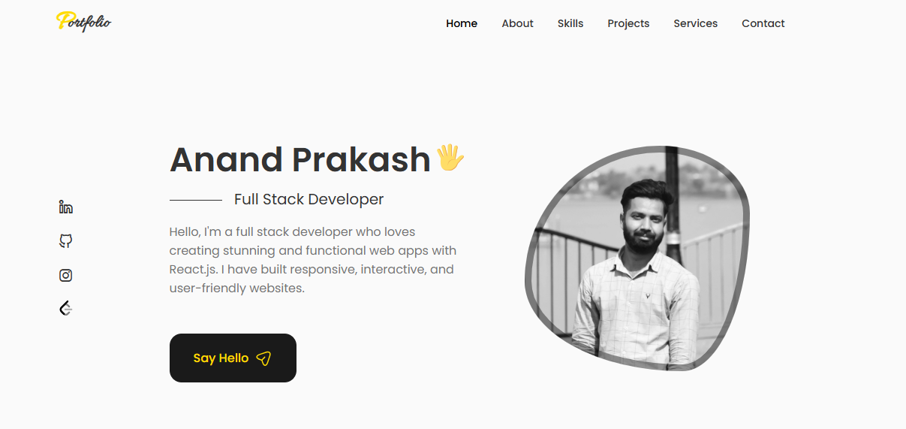

# Anand Prakash - Portfolio

**[🟢 View Live Demo](https://anand-portffolio.netlify.app/)**



---

<p align="center">
  <a href="#about">About</a> •
  <a href="#features">Features</a> •
  <a href="#tech-stack">Tech Stack</a> •
  <a href="#getting-started">Getting Started</a> •
  <a href="#projects">Projects</a> •
  <a href="#contact">Contact</a>
</p>

---

## About

Hello! I'm **Anand Prakash**, a passionate Full Stack Developer who loves creating stunning and functional web applications. This portfolio showcases my skills, projects, and professional journey.

## Features & Structure

✨ **Modern Design** - Clean, responsive UI with smooth scroll animations.  
📱 **Mobile-Friendly** - Fully responsive design that works seamlessly across all devices.  
📧 **Email Integration** - Fully functional contact form powered by EmailJS.  
🗂️ **Comprehensive Sections** - Includes tailored views for Home, About, Skills, Work, Qualifications, Services, and Contact.  
💼 **Project Showcase** - Display of my best work with live links and GitHub repositories

## Tech Stack

- **React 18** - Modern React with hooks
- **Vite** - Lightning-fast build tool
- **CSS3** - Custom styling with animations
- **EmailJS** - Contact form integration

## Getting Started

### Prerequisites

- Node.js (v16 or higher)
- npm or yarn

### Installation

1. Clone the repository

```bash
git clone https://github.com/anandprakash01/portfolio.git
cd portfolio
```

2. Install dependencies

```bash
npm install
```

3. Start the development server

```bash
npm run dev
```

4. Open your browser and navigate to `http://localhost:5173`

### Build for Production

```bash
npm run build
```

The optimized production build will be in the `dist` directory.

### Preview Production Build

```bash
npm run preview
```

## Projects

Here are some of my featured projects:

### 1. Talk to Me – Real-Time Chat Application

- **Tech Stack**: Full-stack, Socket.io
- **Features**: Real-time messaging, group conversations, notifications
- [Live Demo](https://talk-to-mee.netlify.app/) | [GitHub](https://github.com/anandprakash01/talk-to-me)

### 2. Amazon Clone – E-commerce Platform

- **Tech Stack**: React, Redux
- **Features**: Product listings, shopping cart, dynamic UI
- [Live Demo](https://amazonclonewebapp.netlify.app/) | [GitHub](https://github.com/anandprakash01/amazon-clone)

### 3. Event Management System – Enterprise API

- **Tech Stack**: Node.js, REST API
- **Features**: Scalable backend, cluster mode, feature-based architecture
- [GitHub](https://github.com/anandprakash01/event-management-system)

<!-- ## Sections

- **Home** - Introduction and personal greeting
- **About** - Personal information and background
- **Skills** - Technical skills and expertise
- **Work** - Project portfolio with demos and GitHub links
- **Qualification** - Education and professional experience
- **Services** - Services I offer
- **Contact** - Get in touch with me -->

## License

This project is open source and available under the [MIT License](LICENSE).

---

<p align="center">
  Made with ❤️ by <a href="https://github.com/anandprakash01">Anand Prakash</a>
</p>
